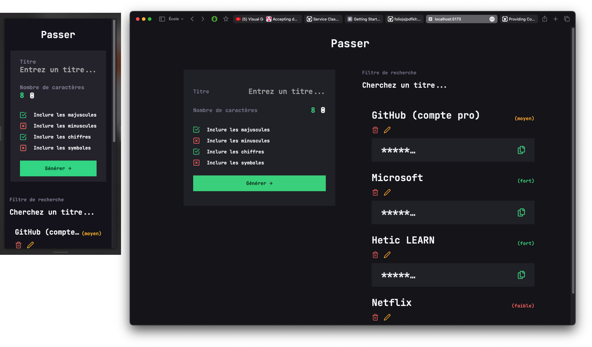

# Passer

## Contexte

Passer est un projet réalisé dans le cadre du cours de Développement FrontEnd TypeScript à HETIC. La consigne est de réaliser une application web performant des actions de CRUD en respesctant une liste de contraintes.



## Installation

### Avec Docker (recommandé)

```bash
git clone <ce repo>
make up-prod # ou make up-dev
```

Consultez en local les versions:

- de production sur le port **:8080**
- de dévelopement sur le port **:5173**

### Sans Docker

```bash
git clone <ce-repo>

cd ./ce-repo/app

npm install

npm run dev
```

## Contraintes techniques et de notations

1. L'application web est **responsive et entièrement naviguable au clavier** dans le respect des contraintes d'accessibilité.
2. Grâce à une réflexion en amont sur le design, j'ai pu réaliser une UI soignée, agréable et accessible.
3. L'experience utilisateur a été également été prise en compte; les préferences de l'utilisateur sont enregistrées et réinjectées pour son usage unique à chaque visite.
4. Le typage des élèments avec **TypeScript** et la documentation des méthodes avec **JSDocs** rend l'application robuste et maintenable.
5. La gestion d'état est gérer via la **création d'un Hook et d'une instance customisée de l'API Context** de React me permettant de communiquer efficacement avec le localStorage.
6. L'architecture de mon dossier a été pensé pour séparer les responsabilités des fichiers.

## Resources

- [L'inspiration pour le Context LocalStorage](https://gist.github.com/jimode/c1d2d4c1ab33ba1b7be8be8c50d64555)
